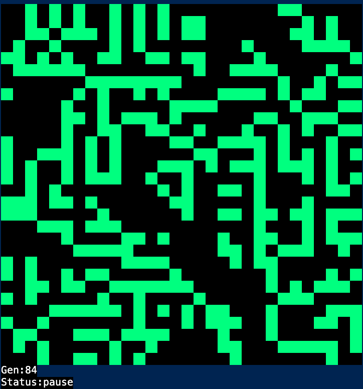

# go-life
Conway's Life Game build by Golang.



# Usage
To start the game, execute `go-life` file.

```
$./go-life
```

The following commands are availble during running Life Game.

```
Enter : Game Start
Space : Pause & Restart   
Ctrl + C : Shutdown
```